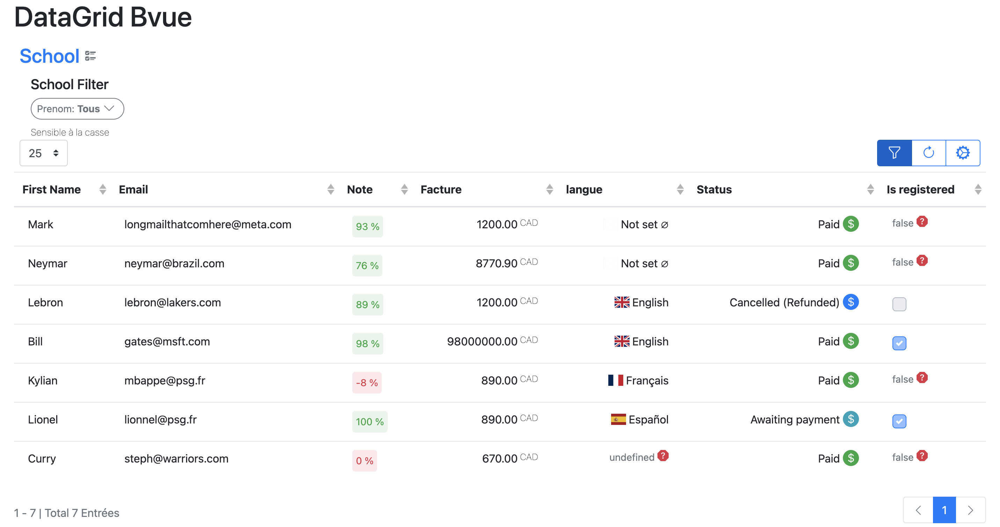

<h1 align='center'>
  Parse - DatagridBvue
</h1>
<h4 align='center'>
  v0.1.0
</h4>
<h5 align='center'>

[](https://github.com/newera-systems/parse-vue-datagrid-engine/actions/workflows/test.yml)

</h5>
<h5 align="center">
 <a href="https://newera-systems.github.io/parse-vue-datagrid-engine">Demo</a>
</h5>

<p align='center'>
  <a href='#datagrid-table'>Datagrid Table</a> |
  <a href='#rule-engine-filter'>Rule engine Filter</a> |
  <a href='#modal-rule-creator'>Datagrid Rule Creator Modal</a>
</p>



Provide Plugin for Grids (table with editable cells). And also components for
filtering. This plugin use BootstrapVue.

For displaying tabular data, <DataGridTable /> supports pagination, filtering,
sorting, various style options, events, and asynchronous data.

- [x] Vue.js v2.7.14 is recommended

- [x] Bootstrap-vue is 2.23.1 recommended

- [x] Bootstrap is 4.6.0 recommended

## Features

Available components:

- [DataGridTable](#datagrid-table)
- [DataGridFilter](#rule-engine-filter)
- [RuleEngineCreatorModal](#modal-rule-creator)

Available features:

- Pagination
- Filtering
- Sorting
- Customizable
- Asynchronous data
- Custom field types
- Custom rules components
- Rules schemas
- Customizable style
- i18n translation (en, fr)

## Installation

### Install with npm
```shell
npm install datagrid-bvue
```
### Install with yarn
```shell
yarn add datagrid-bvue
```

### Demo folder

You can find a demo folder with a complete example.
[Demo](https://github.com/newera-systems/parse-vue-datagrid-engine/tree/master/dev)


```typescript
// Importing styles
import 'datagrid-bvue/style.css';
// Import Bootstrap and BootstrapVue CSS files (order is important)
import 'bootstrap/dist/css/bootstrap.css'
import 'bootstrap-vue/dist/bootstrap-vue.css'
import 'bootstrap-vue/dist/bootstrap-vue-icons.min.css'

// setups the plugin with some options
import DataGridPlugin from 'datagrid-bvue'
Vue.use(DataGridPlugin, {
  ruleSchemas: {
    Student: [
      {identifier: 'id', name: 'id', type: 'String'},
      {identifier: 'firstName', name: 'Prenom', type: 'String'},
      {identifier: 'lastName', name: 'Nom', type: 'String'},
    ],
  },
})
```

### can be initialised with custom field type viewers and editors

```typescript
import CustomTypeViewer from './CustomFieldViewer.vue'
import CustomTypeEditor from './CustomEditor.vue'

Vue.use(DataGridPlugin, {
  lang: 'Fr', //default Fr
  calendarTime: false, //default true
  dateFormat: 'ddd DD-MM-YY HH:mm',
  customFieldTypes: [
    {name: 'SomeType', viewer: CustomTypeViewer, editor: CustomTypeEditor},
  ],
})
```

### can be used with rules schema

Rules schemas allows you to use the Filter component.

```typescript
Vue.use(DataGridPlugin, {
  lang: 'fr',
  ruleSchemas: {
    Student: [
      {identifier: 'id', name: 'id', type: 'String'},
      {identifier: 'firstName', name: 'Prenom', type: 'String'},
      {identifier: 'lastName', name: 'Nom', type: 'String'},
    ],
  },
})
```

The Filter component inject inside your provider ctx object a
FilterRuleInterface Object.

## Usage

### Datagrid Table

#### Extra (provider function, fields type autodetect and pagination) 
- Autodetect fields type with correct edition component in the cell 
- Extra slot for actions
- Provider for async data and Database connection 
  - Generated pagination, can be also used with provider  function by adding "paginationEntries" props.
    ```paginationEntries // number of total entries for pagination using provider function```

```vue
<template>
  <div>
    <h1>{{ title }}</h1>
    <DataGridTable
      name="school"
      :items="provider"
      @goToEditor="goToItemEditor"
    />
  </div>
</template>

<script lang="ts">
import Vue, { defineComponent } from 'vue'

export default defineComponent({
  data() {
    return {
      title: 'Testing datagrid',
      items: [
        {
          id: 'Rebellious66',
          age: 53,
          first_name: 'Dragon',
          last_name: 'Monkey D.',
          da: new Date(),
          skills: [],
        },
      ],
    }
  },
  methods: {
    async provider(ctx) {
      //ctx
      return this.items
    },
    goToItemEditor(item) {
      const msg = 'open complete editor for item, ' + JSON.stringify(item)
      alert(msg)
    },
  },
})
</script>
```

- Modification handler

```vue
<template>
  <div>
    <h1>{{ title }}</h1>
    <DataGridTable
      name="valhalla"
      :items="provider"
      @goToEditor="goToItemEditor"
      @modified="modificationStart"
      :modification-handler="modificationHandler"
    />
  </div>
</template>

<script lang="ts">
import Vue, { defineComponent } from 'vue'

export default defineComponent({
  data() {
    return {
      title: 'Testing datagrid',
      items: [
        {
          id: 'Rebellious66',
          age: 40,
          first_name: 'Ragnar',
          last_name: 'Lothbrok',
          da: new Date(),
          skills: [],
        },
      ],
    }
  },
  computed: {},
  methods: {
    // will call this function after each modification handler routine
    async provider(ctx) {
      // use ctx for api calls
      const delay = (ms) => new Promise((res) => setTimeout(res, ms))
      await delay(2000)
      return this.items
    },
    // can be used to prepare a route to edit page
    goToItemEditor(item) {
      const msg = 'open complete editor for item, ' + JSON.stringify(item)
      alert(msg)
    },
    // you can use a custom modification handler
    async modificationHandler({item, fieldKey, newValue}) {
      item[fieldKey] = newValue
    },
    modificationStart() {
      // a call to the modification handler was emitted
      console.log('modified')
    },
  },
  watch: {},
})
</script>
```

- Other fields

```vue
<template>
  <div>
    <h1>{{ title }}</h1>
    <DataGridTable name="school" :items="items" :fields="fields" striped />
  </div>
</template>

<script lang="ts">
import Vue, { defineComponent } from 'vue'
import {Money} from 'ts-money/build'

export default defineComponent({
  data() {
    return {
      title: 'Testing page',
      items: [
        {
          id: 'aaa',
          a: 'hello_0',
          b: 'Fr',
          c: 10,
          d: 'M',
          e: null,
          f: new Money(1200, 'CAD'),
          g: [],
        },
        {
          id: 'bbb',
          a: undefined,
          b: 'fr',
          c: 78,
          d: '',
          e: {className: 'Invoice'},
          f: 89,
          g: [],
        },
        {id: 'ccc', h: '', i: 'QC', j: null},
      ],
      fields: [
        {
          identifier: 'id',
          name: 'Id title',
          config: {
            canView: true,
            canRead: true,
            canEdit: false,
            canFilter: true,
            canSort: true,
          },
          type: 'String',
        },
        {
          identifier: 'a',
          name: 'message',
          config: {
            canView: true,
            canRead: true,
            canEdit: false,
            canFilter: true,
            canSort: true,
          },
          type: 'String',
        },
        {
          identifier: 'b',
          name: 'Language',
          config: {
            isVisible: true,
            isWritable: true,
            showFilter: false,
            showInGrid: true,
            sortable: false,
          },
          type: 'Lang',
        },
        {
          identifier: 'c',
          name: 'Percent',
          config: {
            canView: true,
            canRead: true,
            canEdit: false,
            canFilter: true,
            canSort: true,
          },
          type: 'Percent',
        },
        {
          identifier: 'd',
          name: 'Gender',
          config: {
            canView: true,
            canRead: true,
            canEdit: false,
            canFilter: true,
            canSort: true,
          },
          type: 'Gender',
        },
        {
          identifier: 'e',
          name: 'Other',
          config: {
            canView: true,
            canRead: true,
            canEdit: false,
            canFilter: true,
            canSort: true,
          },
          type: 'Pointer',
          onClickExternalRoutine: this.testPointerHandler,
        },
        {
          identifier: 'f',
          name: 'Account',
          config: {
            canView: true,
            canRead: true,
            canEdit: false,
            canFilter: true,
            canSort: true,
          },
          type: 'Money',
        },
        {
          identifier: 'g',
          name: 'Courses',
          config: {
            canView: true,
            canRead: true,
            canEdit: false,
            canFilter: true,
            canSort: true,
          },
          type: 'Array',
        },
      ],
    }
  },
  methods: {
    async provider(ctx) {
      // const delay = ms => new Promise(res => setTimeout(res, ms));
      // await delay(3000)
      return this.items
    },
    async testPointerHandler(data) {
      // can be used to start move the page or notify an attempt to modify a pointer type
      console.log(data)
    },
  },
})
</script>
```

#### A usa as Table

B-Table style props available:

<table>
  <thead>
    <th>Name</th>
    <th>Types</th>
  </thead>
  <tbody>
    <tr>
      <td>showFilter</td>
      <td>Boolean</td>
    </tr>
     <tr>
         <td>striped</td>
         <td>Boolean</td>
     <tr>
         <td>bordered</td>
         <td>Boolean</td>
     <tr>
         <td>borderless</td>
         <td>Boolean</td>
     <tr>
         <td>outlined</td>
         <td>Boolean</td>
     <tr>
         <td>small</td>
         <td>Boolean</td>
     <tr>
         <td>hover</td>
         <td>Boolean</td>
     <tr>
         <td>dark</td>
         <td>Boolean</td>
     <tr>
         <td>fixed</td>
         <td>Boolean</td>
     <tr>
         <td>footClone</td>
         <td>Boolean</td>
     <tr>
         <td>headVariant</td>
         <td>String</td>
     <tr>
         <td>noCollapse</td>
         <td>Boolean</td>
     <tr>
         <td>responsive</td>
         <td>Boolean</td>
  </tbody> 
</table>

```vue
<template>
  <div>
    <h1>{{ title }}</h1>
    <DataGridTable
      name="school"
      :items="items"
      :fields="fields"
      @goToEditor="goToItemEditor"
    />
  </div>
</template>

<script lang="ts">
import Vue, { defineComponent } from 'vue'

export default defineComponent({
  data() {
    return {
      title: 'Testing datagrid',
      items: [
        {id: 'aaa', a: 1, b: 2, c: 3},
        {id: 'bbb', a: 4, b: 5, c: 6},
        {id: 'ccc', a: 7, b: 8, c: 9},
      ],
      fields: [
        {
          identifier: 'id',
          name: 'Id title',
          type: 'String',
        },
        {
          identifier: 'a',
          name: 'A',
          type: 'String',
        },
        {
          identifier: 'b',
          name: 'b',
          type: 'String',
        },
      ],
    }
  },
  methods: {
    goToItemEditor(item) {
      const msg = 'open complete editor for item, ' + JSON.stringify(item)
      alert(msg)
    },
  },
})
</script>
```

#### Actions slot

An action slot "#action" is available for each row. You can use it to add
buttons or other actions.

```vue
<template #action="{item, index}">
  action slot
  {{ index }} {{ item }}
</template>
```

```typescript
// add an extra field to use in the action slot
const fields = {
  identifier: '#action',
  name: 'Actions',
  config: {
    canView: true,
    canRead: true,
    canEdit: false,
    canFilter: true,
    canSort: true,
  },
  type: FieldType.String,
}
```

### Rule Engine Filter

To use the filter you need to add the target name that matches the schema name 

// config
```typescript
Vue.use(DataGridPlugin, {
  ruleSchemas: {
    Student: [
      {identifier: 'id', name: 'id', type: 'String'},
      {identifier: 'firstName', name: 'Prenom', type: 'String'},
    ],
  },
})
```

// usage
```vue
<DataGridTable
  name="42 School"
  target="Student"
  :items="provider"
  :fields="fields"
/>
```

- You can also use the filter as a standalone component

```vue
<RuleEngineFilter
  v-model="filterBuild"
  :field-list="authorisedFields"
  operator="AND"
  target="Student"
  visible-name="School"
/>
```

### Modal Rule Creator

```vue
<template>
  <div class="my-4">
    <h2>{{ title }}</h2>
    <div class="d-inline-flex">
      <button class="btn btn-primary ml-4" @click="toggleModal">
        Toggle Modal
      </button>
      <button
        class="btn btn-primary ml-4"
        @click="
          () => {
            useEditor = !useEditor
          }
        "
      >
        Toggle custom editor
      </button>
    </div>
    <RuleEngineCreatorModal
      ref="mod"
      v-model="modalVisible"
      :use-editor="useEditor"
      :rule="filterBuild"
      target="Invoice"
      @update:rule="
        (filterEdited) => {
          filterBuild = filterEdited
        }
      "
    >
      <template v-slot:editor="{value, onEditorInput}">
        <div class="form-group">
          <label for="">Custom editor</label>
          <input
            type="text"
            class="form-control"
            :value="value"
            @input="(val) => onEditorInput(val.target.value)"
          />
        </div>
      </template>
    </RuleEngineCreatorModal>
  </div>
</template>

<script lang="ts">
import Vue, { defineComponent } from 'vue'

export default defineComponent({
  data() {
    return {
      title: 'Rule Creation Modal Tester',
      filterBuild: null,
      modalVisible: false,
      useEditor: false,
    }
  },
  methods: {
    toggleModal() {
      this.$refs.mod.toggleModal()
    },
  },
})
</script>
```
